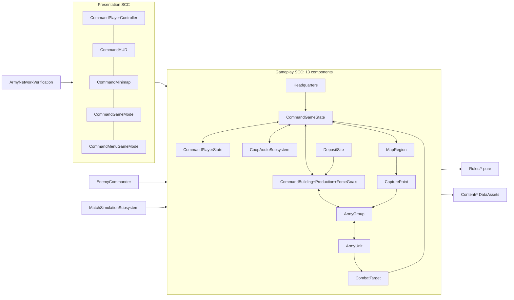

# Architecture audit: Source/CoopRTS (current state, 2026-10-02)

Scope: read-only snapshot of the working tree at `/home/wes/workspace/game`. Nothing was edited or built, and no Unreal process was launched.
Method: include graph parsed from `#include "…"` lines in all 78 `.h`/`.cpp` files under `Source/CoopRTS`. Other measures come from `wc -l`, `rg`, `git log` and `git status`, and UBT logs already on disk.
Definitions:
- **Fan-in** is the number of module files that `#include` a file directly.
- **Rebuild TUs** is the number of the module's 44 `.cpp` translation units that include a header directly or indirectly. It applies to headers only.
- **Fan-out** is the number of module-local headers a file includes.

## 0. Headline findings

1. **The gameplay layer is one dependency knot.** Headers have no `#include` cycle; they forward-declare carefully. At the class level, though, 13 components form a single strongly connected component: ArenaBounds, ArmyGroup, ArmyUnit, CapturePoint, CombatTarget, CommandBuilding, CommandGameState, CommandPlayerState, CoopAudioSubsystem, DepositSite, ForceGoals, Headquarters and MapRegion. Each depends on every other through `.cpp` includes. A second 5-node knot covers presentation: GameMode, HUD, MenuGameMode, Minimap and PlayerController.
2. **`ACommandGameState` is the hub.** 20 components depend on it. There are 74 `GetGameState<ACommandGameState>()` call sites in 25 files. It mixes registry, economy, territory, placement, spawning and audio.
3. **Very little logic is world-free.** Pure, world-free logic is about 212 implementation lines in `Rules/*.cpp`. That is about **6 %** of the roughly 3.7 k lines of gameplay implementation. 18 of 32 automation tests are pure (`RulesTests.cpp`). The other 14 need a loaded map and a running game world.
4. **Parallel lanes have already collided on the same files.** The two lane merges that touched C++ needed manual conflict resolution:
   - `65f8d5e` (group-encapsulation): ArmyGroup.cpp, ArmyNetworkVerification.cpp, ArmyStrategyTests.cpp, ArmyTestSetup.h, CommandGameState.cpp, CommandPlayerController.cpp. Both sides of that merge had changed 10 of the same Source files.
   - `c5423bf` (enemy-economy): CommandBuilding.cpp, CommandGameState.cpp.
5. **The git history does not describe the working tree.**
   - 286 files are untracked. They include 22 C++ files (ForceGoals, MapRegion, Rules/GoalPath, WorldOverlay, the Audio/Session/Simulation subsystems, MenuGameMode, two test files), `AGENTS.md`, `Build/Maps/AvailabilityZoneV2.json`, its generator, and `Content/Maps/AvailabilityZoneV2.umap` and `Menu.umap`.
   - 62 tracked Source/Build/.agents/Config files are modified (+3859/−993 lines; `git diff --shortstat`).
   - Only 27 commits exist.
   - Consequence [INFERENCE]: an agent starting from a `git worktree` or a fresh clone would get a stale game, not the current one.
6. **Compiling is cheap; the Unreal process is the bottleneck.**
   - Incremental UBT runs take 3.3–7.7 s (`~/.config/Epic/UnrealBuildTool/Log*.txt`).
   - A full module compile inside packaging is 33 actions in 9.8–14.6 s (`Saved/Verification/playtest-tonight/{development,shipping}-package.log`).
   - The build is unity (UBT log: `Compile Module.CoopRTS.cpp`). Helpers in anonymous namespaces share a unity TU, so two agents can add same-named helpers in different files and break each other's build. A previous restructure already had to make helpers "unity-safe" (commit "Restructure wave 2 … unity-safe helpers"). [INFERENCE: this remains a live risk]

## 1. Module / layer map

`CoopRTS.Build.cs` (18 lines):
- `PCHUsage = UseExplicitOrSharedPCHs`.
- `PrivateIncludePaths.Add(ModuleDirectory)`, so `Rules/` and `Content/` include root headers by module-relative path (`CoopRTS.Build.cs:8-9`).
- Public dependencies: Core, CoreUObject, Engine, InputCore, EnhancedInput, AIModule, NavigationSystem, GameplayTasks, OnlineSubsystem, OnlineSubsystemUtils (`:10-15`).
- Private dependencies: Json, SlateCore, ApplicationCore (`:16`).
- There is **one module**: tests, the network verification harness, the simulation harness, the Steam session code and the pure rules all compile into the game module. No separate test or editor module exists.

### Lines by layer

| Layer | Lines (.h+.cpp) | Files |
|---|---:|---|
| Automation tests (world + pure) | 3886 | 10 test .cpp + ArmyTestSetup.h |
| Gameplay actors | 3055 | ArmyGroup, ArmyUnit, CommandBuilding(+Production), ForceGoals, CapturePoint, Headquarters, DepositSite, MapRegion, ArenaBounds, CombatTarget, ConstructionTypes |
| Presentation (HUD/minimap/overlay/camera) | 2318 | CommandHUD, CommandMinimap, WorldOverlay, CommandCamera |
| Controller (input + UI FSM + RPC) | 995 | CommandPlayerController |
| Game mode / state / player state | 988 | CommandGameMode, CommandGameState, CommandPlayerState |
| Network verification harness | 731 | ArmyNetworkVerification.cpp |
| Simulation harness | 685 | MatchSimulationSubsystem, SimulationSettings |
| Audio | 490 | CoopAudioSubsystem |
| Session / module / menu | 465 | CoopSessionSubsystem, CommandMenuGameMode, CoopRTS.cpp |
| Pure rules | 371 | Rules/*.h/.cpp |
| AI | 358 | EnemyCommander |
| Content definitions | 179 | Content/*.h/.cpp |
| **Total** | **14521** | 78 files (+ Build.cs 18, Target.cs ×2) |

### Every file

| File | Lines | Role | Fan-in | Rebuild TUs | Fan-out |
|---|---:|---|---:|---:|---:|
| `CommandHUD.cpp` | 1575 | HUD: layout, hit-test, painter, world overlays, panels, menu screens | 0 | – | 15 |
| `CommandPlayerController.cpp` | 869 | Controller: input, UI screen FSM, selection, placement preview, 13 RPCs, travel | 0 | – | 18 |
| `ArmyGroup.cpp` | 774 | Actor: force/squad — orders, nav pathing, combat targeting, reinforcement | 0 | – | 9 |
| `ArmyNetworkVerification.cpp` | 731 | Verification: cmd-line JSON command server for multi-process net tests | 0 | – | 15 |
| `ConstructionTests.cpp` | 702 | Test: world/latent construction+production (2) | 0 | – | 9 |
| `RulesTests.cpp` | 640 | Test: 18 pure policy tests (no world) | 0 | – | 6 |
| `ArmyDoctrineTests.cpp` | 606 | Test: world/latent doctrines (4) | 0 | – | 8 |
| `MatchSimulationSubsystem.cpp` | 548 | Simulation: AI-vs-AI autopilot telemetry (opt-in) | 0 | – | 13 |
| `CommandGameState.cpp` | 486 | Game state: replicated registry + income tick + territory queries + placement + spawn | 0 | – | 15 |
| `CommandBuilding.cpp` | 479 | Actor: building lifecycle, cost/refund, research, appearance, audio | 0 | – | 8 |
| `CoopAudioSubsystem.cpp` | 386 | Audio: GameInstance subsystem, cue lookup, volume save | 0 | – | 2 |
| `ArmyStrategyTests.cpp` | 371 | Test: world/latent enemy AI economy | 0 | – | 6 |
| `ArmyMovementTests.cpp` | 365 | Test: world/latent movement | 0 | – | 6 |
| `GoalOrderTests.cpp` | 351 | Test: world/latent goal orders | 0 | – | 6 |
| `CoopSessionSubsystem.cpp` | 350 | Online: Steam session host/invite/leave, map selection | 0 | – | 1 |
| `EnemyCommander.cpp` | 331 | AI: JEV planner — snapshot, scoring, build placement, goal assignment | 0 | – | 10 |
| `CommandMinimap.cpp` | 292 | HUD helper: minimap draw + screen→world | 0 | – | 11 |
| `ArmyUnit.cpp` | 290 | Actor (ACharacter): unit HP, firing, doctrine modifiers, audio/overlay | 0 | – | 7 |
| `ArmyCombatTests.cpp` | 256 | Test: world/latent combat | 0 | – | 5 |
| `CommandGameMode.cpp` | 241 | Game mode: level discovery, enemy spawn, login slots, outcome, restart | 0 | – | 17 |
| `ForceGoals.cpp` | 230 | Actor impl (ACommandBuilding::SetGoal/TickGoal) + FForceGoalDriver POD | 0 | – | 6 |
| `ForceIdentityTests.cpp` | 221 | Test: world/latent force identity | 0 | – | 3 |
| `CommandBuildingProduction.cpp` | 219 | Actor impl (ACommandBuilding): production adapter over ProductionPolicy | 0 | – | 8 |
| `WorldOverlay.cpp` | 183 | Presentation: instanced-mesh world overlay + subsystem | 0 | – | 1 |
| `CommandBuilding.h` | 169 | Actor: building lifecycle, cost/refund, research, appearance, audio | 15 | 23 | 6 |
| `CapturePoint.cpp` | 148 | Actor: capture-site state machine + overlay ring + audio | 0 | – | 6 |
| `CommandPlayerController.h` | 126 | Controller: input, UI screen FSM, selection, placement preview, 13 RPCs, travel | 11 | 15 | 5 |
| `ArmyTestSetup.h` | 126 | Test fixture helpers (world-bound) | 9 | 9 | 9 |
| `ArmyMatchTests.cpp` | 124 | Test: world/latent victory/defeat restart (2) | 0 | – | 5 |
| `ArmyOrderTests.cpp` | 124 | Test: world/latent orders | 0 | – | 5 |
| `ArmyGroup.h` | 121 | Actor: force/squad — orders, nav pathing, combat targeting, reinforcement | 20 | 24 | 1 |
| `ArmyUnit.h` | 117 | Actor (ACharacter): unit HP, firing, doctrine modifiers, audio/overlay | 25 | 27 | 1 |
| `Rules/PlacementPolicy.cpp` | 116 | Pure rule: grid snap, polygon, territory, clearance verdicts | 0 | – | 1 |
| `CommandCamera.cpp` | 115 | Pawn: RTS camera | 0 | – | 2 |
| `Headquarters.cpp` | 106 | Actor: HQ health, appearance, audio | 0 | – | 4 |
| `CoopAudioSubsystem.h` | 104 | Audio: GameInstance subsystem, cue lookup, volume save | 7 | 7 | 1 |
| `CommandGameState.h` | 94 | Game state: replicated registry + income tick + territory queries + placement + spawn | 22 | 29 | 2 |
| `CommandPlayerState.cpp` | 79 | Player state: wallet, doctrine, team/commander slot | 0 | – | 3 |
| `Rules/PlacementPolicy.h` | 72 | Pure rule: grid snap, polygon, territory, clearance verdicts | 6 | 6 | 0 |
| `CoopSessionSubsystem.h` | 64 | Online: Steam session host/invite/leave, map selection | 3 | 3 | 0 |
| `WorldOverlay.h` | 59 | Presentation: instanced-mesh world overlay + subsystem | 4 | 4 | 0 |
| `MatchSimulationSubsystem.h` | 59 | Simulation: AI-vs-AI autopilot telemetry (opt-in) | 1 | 1 | 0 |
| `Content/UnitDefinition.h` | 57 | Content: UDataAsset unit definition + EUnitRole | 5 | 29 | 0 |
| `Content/BuildingDefinition.h` | 56 | Content: UDataAsset building definition | 8 | 25 | 1 |
| `SimulationSettings.cpp` | 54 | Config: command-line simulation constants | 0 | – | 1 |
| `CapturePoint.h` | 51 | Actor: capture-site state machine + overlay ring + audio | 12 | 12 | 0 |
| `CommandPlayerState.h` | 50 | Player state: wallet, doctrine, team/commander slot | 16 | 31 | 0 |
| `Headquarters.h` | 48 | Actor: HQ health, appearance, audio | 16 | 20 | 0 |
| `CommandHUD.h` | 44 | HUD: layout, hit-test, painter, world overlays, panels, menu screens | 5 | 5 | 0 |
| `ArenaBounds.cpp` | 39 | Actor: level-placed arena extent (map data) | 0 | – | 2 |
| `CommandGameMode.h` | 38 | Game mode: level discovery, enemy spawn, login slots, outcome, restart | 3 | 3 | 0 |
| `MapRegion.h` | 38 | Actor: territory polygon + adjacency (map data) | 13 | 13 | 0 |
| `DepositSite.cpp` | 38 | Actor: resource deposit (map data) | 0 | – | 3 |
| `CombatTarget.cpp` | 37 | Helper: polymorphic target dispatch (unit/building/HQ) | 0 | – | 6 |
| `CommandCamera.h` | 35 | Pawn: RTS camera | 3 | 3 | 0 |
| `Content/MatchContent.h` | 34 | Content: UDataAsset catalogue (index contract) | 12 | 20 | 2 |
| `ArenaBounds.h` | 33 | Actor: level-placed arena extent (map data) | 12 | 20 | 0 |
| `Rules/ProductionPolicy.h` | 31 | Pure rule: production state precedence + progress | 3 | 25 | 0 |
| `Rules/ProductionPolicy.cpp` | 31 | Pure rule: production state precedence + progress | 0 | – | 1 |
| `Content/MatchContent.cpp` | 31 | Content: UDataAsset catalogue (index contract) | 0 | – | 1 |
| `MapRegion.cpp` | 30 | Actor: territory polygon + adjacency (map data) | 0 | – | 3 |
| `Rules/EconomyPolicy.cpp` | 29 | Pure rule: extractor payment, refund, affordability | 0 | – | 1 |
| `Rules/GoalPath.cpp` | 28 | Pure rule: BFS next waypoint on region bitset graph | 0 | – | 1 |
| `EnemyCommander.h` | 27 | AI: JEV planner — snapshot, scoring, build placement, goal assignment | 9 | 13 | 0 |
| `ForceGoals.h` | 27 | Actor impl (ACommandBuilding::SetGoal/TickGoal) + FForceGoalDriver POD | 5 | 24 | 1 |
| `DepositSite.h` | 27 | Actor: resource deposit (map data) | 12 | 12 | 0 |
| `Rules/EconomyPolicy.h` | 27 | Pure rule: extractor payment, refund, affordability | 5 | 5 | 0 |
| `CoopRTS.cpp` | 26 | Module: startup hooks net verification | 0 | – | 0 |
| `SimulationSettings.h` | 24 | Config: command-line simulation constants | 4 | 4 | 0 |
| `ConstructionTypes.h` | 20 | Shared enums (EBuildingKind, EFrontOrder) | 5 | 33 | 0 |
| `Rules/OutcomePolicy.h` | 18 | Pure rule: victory/defeat from HQ health | 3 | 3 | 0 |
| `CommandMinimap.h` | 15 | HUD helper: minimap draw + screen→world | 2 | 2 | 0 |
| `CombatTarget.h` | 14 | Helper: polymorphic target dispatch (unit/building/HQ) | 3 | 3 | 0 |
| `CommandMenuGameMode.h` | 14 | Game mode: frontend menu world | 2 | 2 | 0 |
| `CommandMenuGameMode.cpp` | 11 | Game mode: frontend menu world | 0 | – | 3 |
| `Rules/GoalPath.h` | 11 | Pure rule: BFS next waypoint on region bitset graph | 3 | 26 | 0 |
| `Rules/OutcomePolicy.cpp` | 8 | Pure rule: victory/defeat from HQ health | 0 | – | 1 |
| `Content/BuildingDefinition.cpp` | 1 | Content: UDataAsset building definition | 0 | – | 1 |

### Most-coupled files

- **Highest fan-out:**

  | File | Local headers included |
  |---|---:|
  | CommandPlayerController.cpp | 18 |
  | CommandGameMode.cpp | 17 |
  | CommandGameState.cpp | 15 |
  | CommandHUD.cpp | 15 |
  | ArmyNetworkVerification.cpp | 15 |
  | MatchSimulationSubsystem.cpp | 13 |
  | CommandMinimap.cpp | 11 |

- **Highest rebuild cost** (the header recompiles N of 44 TUs):

  | Header | Rebuild TUs | Why |
  |---|---:|---|
  | ConstructionTypes.h | 33 | two enums |
  | CommandPlayerState.h | 31 | it declares `EArmyDoctrine`, so `CommandGameState.h:4`, `CommandBuilding.h:5` and `CommandPlayerController.h:8` include it |
  | CommandGameState.h | 29 | |
  | Content/UnitDefinition.h | 29 | `EUnitRole` lives here |
  | ArmyUnit.h | 27 | |
  | Rules/GoalPath.h | 26 | pulled in through `ForceGoals.h` ← `CommandBuilding.h:9` |
  | Rules/ProductionPolicy.h | 25 | pulled in through `CommandBuilding.h:8` |

  Editing a pure-rule header therefore rebuilds most of the module.
- **`RulesTests.cpp`, the pure test file, includes `CommandGameState.h` only for `EMatchResult`** (`RulesTests.cpp:8`). This drags the GameState → PlayerState → ConstructionTypes chain into the pure test TU.

## 2. Dependency graph

- **Header-level cycles: none.** I ran a DFS over header→header edges. Headers forward-declare (for example `CommandGameState.h:9-16` and `ArmyGroup.h:8-11`).
- **Component-level cycles (`.h` + `.cpp` merged): 2 SCCs.**
  - Gameplay (13 nodes, listed in §0). Example edges:
    - `CommandGameState.cpp:3-19` includes ArmyUnit, CommandBuilding, CoopAudioSubsystem, Headquarters, MapRegion, DepositSite and CapturePoint.
    - Every one of those `.cpp` files includes `CommandGameState.h`.
    - Audio↔GameState is a cycle: `CoopAudioSubsystem.cpp` includes `CommandGameState.h`, and `CommandGameState.cpp:8` includes the audio subsystem.
  - Presentation (5 nodes):
    - `CommandPlayerController.cpp` includes CommandHUD.h, CommandGameMode.h and CommandMenuGameMode.h.
    - `CommandGameMode.cpp` includes CommandHUD.h and CommandPlayerController.h.
    - `CommandHUD.cpp` includes CommandPlayerController.h.
- **Only the leaves are decoupled:** Rules/*, Content/*, SimulationSettings, WorldOverlay, CommandCamera and CoopSessionSubsystem. None of them includes a gameplay actor.
- **The GameState is a service locator.** The 74 `GetGameState<ACommandGameState>()` sites break down as:

  | File | Sites |
  |---|---:|
  | CommandPlayerController.cpp | 17 |
  | CommandBuilding.cpp | 10 |
  | ArmyGroup.cpp | 7 |
  | CommandGameMode.cpp | 6 |
  | CommandBuildingProduction.cpp | 4 |

  Actors find each other through `State->Regions/Deposits/Buildings/FriendlyHeadquarters/...` (`CommandGameState.h:57-80`) or through `TActorIterator`. The latter is used 59 times, mostly in tests and harnesses; in gameplay code it appears in ArmyGroup.cpp:596, CapturePoint.cpp:69, CommandGameState.cpp:38 and :303, and EnemyCommander.cpp:177.
- **Team identity is hard-coded as the literals 0 (friendly) and 5 (JEV).** It appears across ~20 files: CommandGameState.cpp 16 hits, ArmyStrategyTests 13, EnemyCommander 9, CommandHUD 6, CapturePoint 6, ArmyGroup 6, CoopAudio 5, and others. Examples: `CapturePoint.cpp:75-76,93-94`, `ArmyGroup.cpp:603`, `CommandGameState.cpp:137,147,271`. No team type or policy exists.
- **Adding an enum value spreads widely:**

  | Enum | Files | References |
  |---|---:|---:|
  | `EArmyDoctrine` | 12 | 78 |
  | `EUnitRole` | 13 | 69 |
  | `EForceGoal` | 8 | 85 |
  | `EFrontOrder` | 12 | 54 |
  | `EMatchResult` | 21 | 70 |
  | `EHUDAction` | 3 | 144 |

  `EHUDAction` ordinals are frozen for external Python probes (`CommandHUD.h:7`).

## 3. God objects and their mixed responsibilities

### `ACommandGameState` (`.h` 94 lines + `.cpp` 486 lines; 8 commits, the most-churned file)
| Responsibility | Where |
|---|---|
| Replicated registry of every match actor plus the content catalogue | `CommandGameState.h:57-80` |
| Economy: 2 s income cadence, baseline pay, extractor payout and depletion | `CommandGameState.cpp:124-160` |
| Income queries | `:162-182` |
| Territory queries (region at point, controller, contested, anchor) | `:184-264` |
| Placement validation, including physics overlap and navmesh probes, client/server branch | `:266-369` (`:344-350` "Navigation checked by server") |
| Building spawn transaction (owner validation, payment, deposit reservation, rollback) | `:371-469` |
| Match result and outcome audio | `:96-114` |
| Enemy plan text for the HUD (written by EnemyCommander and GameMode) | `.h:75-78`, `EnemyCommander.cpp:170-172,325-330`, `CommandGameMode.cpp:48-50` |
| Player roster filtering (JEV excluded) | `:116-122` |
| Test-only fixture flag | `.h:81-84` |

### `ACommandPlayerController` (`.h` 126 lines + `.cpp` 869 lines; 7 commits)
| Responsibility | Where |
|---|---|
| Input mapping setup | `.cpp:88-120` |
| Camera pan, drag, zoom and initial focus | `:122-160`, `:260-265`, `:703-716` |
| Placement-grid preview **rendering** through WorldOverlay | `:161-202` |
| Goal and front overlay rendering | `:203-257` |
| Cursor raycasts and region picking | `:267-300` |
| UI screen state machine (main menu, pause, controls, audio volume, confirm leave/quit, result) and map travel | `.h:20`, `.cpp:377-510` (hard-coded map paths `:445`, `:486`) |
| HUD action dispatch, which turns UI actions into commands | `:629-700` |
| Selection | `:572-628` |
| **All 13 RPCs in the game** (9 Server, 4 Client) with hand-written validation and user-facing strings | `.h:47-72`, `.cpp:727-869` |
| Seamless-travel and restart handling | `:76-87`, `:364-376` |

### `ACommandHUD` (`.h` 44 lines + `.cpp` 1575 lines; the largest file)
The class has only 7 methods (`:1453-1575`). Everything else is about 1400 lines of anonymous-namespace free functions (`:56-1452`):

| Responsibility | Where |
|---|---|
| Context capture from the controller and world | `:119-160` |
| Layout | `:188-262` |
| Button registry and enumeration, which also encodes gameplay "block" reasons (funds, locked, terminal) | `:263-420` |
| Painter primitives | `:475-600` |
| In-world health bars and structure/sector/force overlays | `:601-770` |
| **Force counting (game-state aggregation inside the HUD)** | `:770-815` |
| Top bar, build panel, building inspector, overview | `:827-1257` |
| Mode bar and feedback | `:1258-1331` |
| Menu, pause, controls, audio and result screens | `:1332-1452` |
| Minimap glue | `:1500-1522` |

`EHUDAction` (`CommandHUD.h:9-24`) is the shared contract between the HUD, the controller, `ArmyNetworkVerification.cpp` and `.agents/skills/verify-cooprts/scripts/hud_capture.py`.

### `AEnemyCommander` (`.h` 27 lines + `.cpp` 331 lines)
`EvaluatePlan` is one 213-line function (`EnemyCommander.cpp:118-331`). It mixes:
- World snapshot (`:136-203`).
- A private region BFS that duplicates `Rules/GoalPath` (`:33-51`).
- Deposit scoring (`:189-213`).
- Threat and defender assignment (`:215-231`).
- Advantage heuristic (`:238-239`).
- Role-mix choice (`:243-250`).
- Recovery thresholds (`:252-261`).
- Expansion scoring (`:276-294`).
- Forward build site (`:301-315`).
- Build/research priority (`:317-324`).
- HUD text writes into GameState (`:325-330`).

`BuildNear` (`:68-116`) is a ring search that calls `TryPlaceBuilding`. **The AI calls actor methods directly** (`SetProduction :249`, `SetGoal :298`, `TryResearch :324`, `TryPlaceBuilding :87,113`). It bypasses the controller-RPC validation that human commands go through, so each command has two entry points.

### `ACommandBuilding` (`.h` 169 lines; `.cpp` 479 + `CommandBuildingProduction.cpp` 219 + `ForceGoals.cpp` 230)
One class implemented across three files. It mixes:
- Lifecycle and HP.
- Cost, refund and research transactions (`CommandBuilding.cpp:284-330`).
- Production adapter.
- Goal driver (`ForceGoals.cpp:67-230`).
- Front assignment.
- Mesh/appearance selection (`:209-262`).
- Deposit reservation.
- Audio state machine: 10 bookkeeping fields at `.h:132-143`, logic at `.cpp:340-452`.
- Multicast terminal snapshot (`.h:151-152`).

It has 22 replicated properties, the most of any class.

### `AArmyGroup` (`.h` 121 lines + `.cpp` 774 lines)
- Order state.
- Navmesh path preparation (`:44-83`).
- Formation.
- Spawn and reinforcement (`:154-368`).
- Travel orders (`:405-541`).
- Combat targeting and pursuit for every unit (`UpdateCombat :587-723`).
- Match settle.

## 4. Pure logic vs engine-bound

### World-free today
These are tested by `RulesTests.cpp` (640 lines, 18 tests, `CoopRTS.Rules.*`):
- `Rules/PlacementPolicy` (72 + 116 lines). Input structs only; the header comment says "policies never read actors or world state" (`PlacementPolicy.h:5`).
- `Rules/ProductionPolicy` (31 + 31).
- `Rules/EconomyPolicy` (27 + 29).
- `Rules/OutcomePolicy` (18 + 8). It avoids including the actor through a forward-declared enum (`OutcomePolicy.h:5-7`).
- `Rules/GoalPath` (11 + 28).

Also pure or near-pure, but untested in isolation:
- `BuildSlot` / `RecipeSlot` (`CommandHUD.cpp:28-55`).
- `CommandMinimap::ScreenToWorld`. It reads only `Arena->HalfExtent` (`CommandMinimap.h:14`).
- `FForceGoalDriver`, a plain struct (`ForceGoals.h:11-27`).
- `FSimulationSettings` command-line parsing.

**Caveat:** even pure tests are `IMPLEMENT_SIMPLE_AUTOMATION_TEST` inside the game module (`RulesTests.cpp:206-222,584`). Running them still needs an Unreal process (Editor-Cmd or game) that loads the project. No standalone C++ test binary exists. [INFERENCE from the module layout. TestAudit owns the runner details.]

### Estimate
- Gameplay implementation, excluding HUD, audio, session, tests and harnesses: ~3,527 lines in actors, mode/state and AI, plus 212 lines in `Rules/*.cpp`.
- World-free share: **212 / 3,739 ≈ 6 %** of lines.
- By test count: **18 / 32 tests (56 %)** are world-free. The other 14 are latent world tests that need a loaded map via `ArmyTestSetup::World()` (`ArmyTestSetup.h:50-57`).

### Logic buried in actors that could be extracted
The pattern would be the same as `Rules/*`: an input struct, a decision struct, and the actor as adapter.

| Logic | Where | ≈Lines | Already partially pure? |
|---|---|---:|---|
| JEV planning: scoring, role mix, recovery, expansion, build priority | `EnemyCommander.cpp:118-331` | 210 | no; also duplicates BFS (`:33-51`) |
| Combat target selection and pursuit-goal clamp | `ArmyGroup.cpp:613-694` (`Permitted` lambda `:617-631`, nearest `:634-657`, clamp `:684-694`) | 80 | no |
| Damage, range and heal modifiers from doctrine | `ArmyUnit.cpp:102-117, 192-196, 239-240, 251-255` | 30 | no (constants 1.25, 3/4, 5 s, 5 hp/s hard-coded) |
| Capture progress state machine | `CapturePoint.cpp:79-94` | 20 | no (0.125/s, team 0/5 literals) |
| Goal driver tick (waypoint advance, refill) | `ForceGoals.cpp:118-230` | 110 | the path piece is (`GoalPath`) |
| Goal validation | `ForceGoals.cpp:67-95` | 30 | partly |
| Income cadence and wallet eligibility | `CommandGameState.cpp:131-158` | 30 | the payment math is (`EconomyPolicy`) |
| Placement verdict → reason text; owner validation | `CommandGameState.cpp:311-323, 383-391` | 25 | the verdict is |
| RPC command validation (owned army/building, attack target validity) | `CommandPlayerController.cpp:511-531, 816-836` | 40 | no; overlaps `CombatTarget::IsAliveHostile` |
| HUD button availability/"block" reasons and layout/hit-test | `CommandHUD.cpp:188-420` | 230 | no; mixes data access with layout |
| Force counting for the HUD | `CommandHUD.cpp:770-815` | 45 | no |

Extracting all of these would add roughly 850 lines of world-free decision logic, which would cover about 25–30 % of gameplay lines. [INFERENCE]

## 5. Data flow: content, maps, runtime

### Content definitions
- `Build/GenerateMatchContent.py` (103 lines) creates or updates the 7 DataAssets:
  - `Content/Units/DA_{Frontline,Ranged,Siege}.uasset`.
  - `Content/Content/DA_{Barracks,Outpost,Workshop,MatchContent}.uasset`. The extractor reuses the `DA_Outpost` name (`:76`).
  - The value tables are at `:57-60` and `:77-80`.
- **Combat stats are text only on first creation.** `max_health`, `attack_damage`, `range` and `interval` are `create_defaults` (`:62-65`), applied only when the asset does not exist yet (`:31-46`; docstring `:3-4` "keep their tuned combat values"). For existing assets, **the binary `.uasset` is the source of truth for combat stats.** The Python table can silently disagree with them.
- **A second generator duplicates the unit table:** `Build/GenerateCombatUnits.py:12-16`. Two ways to do one job.
- **Catalogue order is a replicated contract** encoded in three places:
  - Docstring `GenerateMatchContent.py:4-5`.
  - `MatchContent.h:9-10`.
  - `ArmyTestSetup.h:19-20` (`BarracksIndex = 0, ExtractorIndex = 1, WorkshopIndex = 2`).

### Runtime path
1. `ACommandGameMode` constructor hard-loads `/Game/Content/DA_MatchContent` (`CommandGameMode.cpp:33`).
2. `BeginPlay` assigns `State->Content` (`:136`), which is replicated (`CommandGameState.h:57-58`).
3. Actors replicate **indices** into it: `CommandBuilding.h:81-83,100-102`, `ArmyUnit.h:71-73`. ArmyUnit also replicates a `Definition` pointer (`ArmyUnit.h:75`).

### Gameplay constants outside DataAssets
These are hard-coded in C++:
- `ResearchCost = 150` (`CommandBuilding.h:45`).
- `InitialResources = 600` (`CommandPlayerState.h:24`).
- HQ health 900 (`Headquarters.h:21`).
- `BaselineIncomePerSecond = 2` (`CommandGameState.h:53`), duplicated by `FSimulationSettings::BaselineIncome = 2` (`SimulationSettings.h:12`).
- Deposit rates and amounts (`SimulationSettings.h:13-16`).
- Doctrine modifiers (§4).
- Capture rate.
- AI weights.

### Maps
| Map | Source of truth | Generator | Output |
|---|---|---|---|
| AvailabilityZoneV2 (the packaged default per the latest commit) | `Build/Maps/AvailabilityZoneV2.json` (337 KB, **untracked**). Derived from `Art/Maps/*.excalidraw` (untracked) by `Build/DrawAvailabilityZoneV2.py --derive` (`:1-11`) | `Build/GenerateAvailabilityZoneV2.py` (336 lines; reads JSON `:18,89`; imports `MatchLayout`) | `Content/Maps/AvailabilityZoneV2.umap` (untracked) |
| AvailabilityZone v1 | `Build/Maps/AvailabilityZone.json` (25 KB, tracked) | `Build/AvailabilityZoneLayout.py` (pure Python, runnable without Unreal, `:1-12`) → `Build/GenerateAvailabilityZone.py` | `AvailabilityZone.umap` |
| Boot, CampusZero | Coordinates in Python: `Build/MatchLayout.py:16` (`SITES`), `GenerateCommandMap.py`, `GenerateCampusZero.py` | same | `.umap` |
| Menu | `Build/GenerateMenuMap.py` (20 lines, untracked) | — | `Menu.umap` (untracked) |

- **The runtime discovers maps as data.** `InitGameState` scans placed `AArenaBounds`, `AHeadquarters`, `ACapturePoint`, `AMapRegion` and `ADepositSite` and sorts them by index (`CommandGameMode.cpp:76-129`).
- **Map paths are hard-coded in several places:**
  - `CoopSessionSubsystem.h:27` (V2/V1 toggle).
  - `CommandPlayerController.cpp:445` and `:486`.
  - `CoopSessionSubsystem.cpp:310`.
  - `Config/DefaultEngine.ini:2-3`.
- **Rules are duplicated across languages, and the copies have drifted:**
  - `Build/DrawMapLayout.py:16,530-532,672` re-implements "the 2D rules of `ACommandGameState::ValidateBuildingPlacement`".
  - `Build/Maps/AvailabilityZone.json:28-63` holds a `constants` copy of gameplay numbers:
    - `"baseline_income": 10`, while C++ uses 2.
    - `"jev_ring": [360, 810]`, while C++ uses `380 + Ring*160` at `EnemyCommander.cpp:98`.

### Text vs binary
| Text (diffable and mergeable) | Binary (Git LFS per `.gitattributes`: `*.uasset`, `*.umap`, `*.fbx`, `*.blend`, `Art/**` png/jpg/wav) |
|---|---|
| All C++ (78 files), `Build/*.py` (36 scripts, 15.7 k lines), `Build/Maps/*.json`, `Config/*.ini`, Docs, `.agents/skills/verify-cooprts/**`, `Art/Maps/*.excalidraw` | The 7 DataAssets (gameplay numbers and catalogue order), 7 `.umap`, 316 `.uasset` total (meshes, materials, audio, mix) |

Only the map layout and the non-combat content fields round-trip through text. Combat stats live only in binary (see above). So do the placed-actor properties in any map that was not regenerated, and any editor-tuned values.

## 6. Replication and networking boundaries

**RPCs.** All gameplay RPCs live on `ACommandPlayerController` (`.h:47-72`):
- Server, all Reliable: `PlaceBuilding`, `CancelBuilding`, `ConfigureProduction`, `AssignGoal`, `AssignFront`, `Research`, `IssueOrder`, `IssueAttack`, `RequestRestart`.
- Client: `ConstructionFeedback`, `PlacementFeedback`, `AttackFeedback`, `OrderFeedback`.
- There is one NetMulticast: `ACommandBuilding::MulticastTerminalState` (`CommandBuilding.h:151-152`).
- No RPC uses `WithValidation`. Validation is hand-written in each `_Implementation`, for example `IsValidBuildingCommand` (`CommandPlayerController.cpp:527`) and the target checks in `ServerIssueAttack` (`:816-836`).

**Replicated state** (`DOREPLIFETIME` count):

| Class | Count |
|---|---:|
| CommandBuilding | 22 |
| ArmyGroup | 14 |
| ArmyUnit | 12 |
| CommandGameState | 12 |
| MapRegion | 7 |
| CapturePoint | 6 |
| CommandPlayerState | 4 |
| DepositSite | 4 |
| ArenaBounds | 2 |
| Headquarters | 2 |

- Every gameplay actor is `bAlwaysRelevant = true`: ArmyGroup.cpp:102, ArmyUnit.cpp:26, CapturePoint.cpp:19, CommandBuilding.cpp:24, Headquarters.cpp:17, MapRegion.cpp:11, DepositSite.cpp:11, ArenaBounds.cpp:11.
- `AEnemyCommander` is server-only (`bReplicates = false`, `EnemyCommander.cpp:57`). Its output reaches clients through `GameState.EnemyPlan*`.
- Presentation and audio are driven from `OnRep_*` inside gameplay actors (`ArmyUnit.cpp:136,203`, `CommandBuilding.cpp:209,340,424,439`, `CapturePoint.cpp:107`, `Headquarters`, `GameState.cpp:104`). Gameplay classes therefore carry client-only audio bookkeeping fields.

**Authority checks are distributed, with no single command boundary.** 71 `HasAuthority`/`GetNetMode`/`GetLocalRole` sites span 26 files. The largest counts:

| File | Sites |
|---|---:|
| CommandBuilding.cpp | 13 |
| ArmyGroup.cpp | 7 |
| ArmyUnit.cpp | 4 |
| CommandGameState.cpp | 4 |
| CommandPlayerState.cpp | 4 |
| CoopAudioSubsystem.cpp | 4 |

Every mutator re-checks authority and match state itself, for example `ForceGoals.cpp:70-75` and `ArmyUnit.cpp:225-229, 247-249`.

**Commands have three entry paths:**
1. Human: the controller RPC, then the actor method.
2. AI: the actor method directly (`EnemyCommander.cpp:87,249,298,324`).
3. Tests and harness: call `PC->Server*` directly (`ArmyTestSetup.h:123`, `ArmyNetworkVerification.cpp:350-370,436-444`) or mutate actor fields directly (`ArmyTestSetup.h:118-121`).

**The same validator runs on client and server.** `ValidateBuildingPlacement` serves the client preview (via `CommandPlayerController::CanPlaceBuildingAt :332`) and the server, with a net-mode branch at `CommandGameState.cpp:341-351`.

**Network verification** is opt-in from the command line (`ArmyNetworkVerification.cpp:717-723`; hooked at `CoopRTS.cpp:14,20`). It is a string-keyed dispatcher (`Execute :339-682`) with about 25 actions (`observe`, `build`, `production`, `goal`, `cancel`, `research`, `select`, `hud`, `hudClick`, `key`, `screenshot`, `restart`, `order`, `attack`, `isolate`, `placement`, `income`, …), driven by `.agents/skills/verify-cooprts/scripts/network.py` (946 lines).

## 7. Top 10 collision hotspots for parallel work

Evidence columns:
- **Commits:** number of the repo's 27 commits that touched the file.
- **Lane overlap / conflict:** whether the file was changed on both sides of a merge (`git diff <base> <parent>`), and whether the merge commit carries a combined-diff (`--cc`) conflict-resolution hunk.

| # | Hotspot | Lines | Commits | Lane overlap / conflict | Why every task lands here |
|---|---|---:|---:|---|---|
| 1 | `CommandGameState.cpp/.h` | 486+94 | 8 (max) | both lanes in 65f8d5e **and** c5423bf; conflict in both | Economy, territory, placement and spawning all live here. Header rebuilds 29 TUs. 74 access sites. |
| 2 | `CommandPlayerController.cpp/.h` | 869+126 | 7 | 65f8d5e conflict; c5423bf touched | Every new player command needs an RPC in the `.h` (15 TUs), dispatch in `HandleHUDAction`, validation and feedback strings. Menus and travel live here too. |
| 3 | `CommandHUD.cpp/.h` | 1575+44 | 4 | — | Any UI change, any new button, any new displayed stat. `EHUDAction` is append-only with ordinals frozen for Python probes (`CommandHUD.h:7`). Shared with the controller and the net harness. |
| 4 | `CommandBuilding.h` + `.cpp` + `CommandBuildingProduction.cpp` + `ForceGoals.cpp` | 169+479+219+230 | 5/5/5/– | both lanes in 65f8d5e and c5423bf; c5423bf conflict | One class owns production, goals, research, appearance and audio. Header rebuilds 23 TUs. 22 replicated properties. |
| 5 | Network verification: `ArmyNetworkVerification.cpp` + `verify-cooprts/scripts/network.py`, `verify.py`, `hud_capture.py` | 731 + 946/367/454 | 7 + 5/4/4 | 65f8d5e conflict | Every multiplayer-verifiable feature adds a string action to one `Execute` function (`:339-682`) and to one Python driver. |
| 6 | `ArmyGroup.cpp/.h` | 774+121 | 6 | 65f8d5e conflict | Movement, combat, reinforcement and fronts in one actor. Header rebuilds 24 TUs. |
| 7 | Shared enum headers: `CommandPlayerState.h` (`EArmyDoctrine`), `ConstructionTypes.h` (`EBuildingKind`, `EFrontOrder`), `Content/UnitDefinition.h` (`EUnitRole`), `ForceGoals.h` (`EForceGoal`) | 50/20/57/27 | 4/–/–/– | c5423bf touched PlayerState | A new doctrine, role, front or goal touches 8–13 files and rebuilds 24–33 TUs. |
| 8 | Test fixtures: `ArmyTestSetup.h` + world tests (`ArmyStrategyTests.cpp`, `ConstructionTests.cpp`) | 126 + 371/702 | 5 + 6/4 | 65f8d5e conflict in ArmyTestSetup.h and ArmyStrategyTests.cpp | One fixture header for all 9 world-test TUs. It pins catalogue indices and HQ-relative staging. |
| 9 | Binary content plus its generators: `DA_MatchContent` and 6 sibling DAs, `.umap` files, `GenerateMatchContent.py`, map generators | 7 DAs, 7 maps | `.umap` 4 | LFS `-text`: **unmergeable** | Any balance or catalogue change rewrites the same binary assets. Any map change regenerates the whole `.umap`. Both need the single Unreal process. |
| 10 | `EnemyCommander.cpp` (+ `CommandGameMode.cpp`) | 331 (+241) | 5 (+7) | both touched on both sides of 65f8d5e and c5423bf | One 213-line `EvaluatePlan`. Any economy, production or goal change must also teach the AI. GameMode owns match bootstrap and outcome. |

Also contended, but text-only and docs: `README.md` (8 commits), `.agents/skills/verify-cooprts/SKILL.md` (6), `features/economy.md` (5), `Docs/World.md` (5), `Docs/Design/status.md`.

## 8. What is already designed for isolation

- **`Rules/` policies**: input/decision structs, no actors (`PlacementPolicy.h:5`, `ProductionPolicy.h:29`), with focused tests (`CoopRTS.Rules.*`, 18 tests). The lane `rules-extraction` merged with **no** file overlap (merge `1a0c7ba`), and so did `p3-income`, which only touched `EconomyPolicy` and `RulesTests` (`8517885`). This is the pattern that parallelises.
- **Data-driven catalogue**: `UMatchContent` with Id lookup (`MatchContent.h:25-33`). Actors replicate indices. `BuildingDefinition` capabilities (`bProducesForces`/`bRequiresDeposit`/`bOffersResearch`) replace kind branching. `EBuildingKind` is marked "migration-only" (`BuildingDefinition.h:51`), and only 13 references remain.
- **Level as data**: match actors are placed in the map and discovered by `InitGameState` (`CommandGameMode.cpp:76-129`). Tests stage relative to the HQs, "the level, not the test, decides where the map is" (`ArmyTestSetup.h:31-44`).
- **Partial-class file split**: `ACommandBuilding` production and goals are in separate `.cpp` files (`CommandBuilding.h:67,75`).
- **Pure-Python map tooling**: `AvailabilityZoneLayout.py`, `DrawMapLayout.py` and `DrawAvailabilityZoneV2.py` validate layouts without Unreal.
- **Opt-in harnesses**: `UMatchSimulationSubsystem::ShouldCreateSubsystem` is gated on `-autopilot` (`MatchSimulationSubsystem.cpp:49-53`, `SimulationSettings.cpp:33`). Net verification is gated on `CoopRTSNetVerifyDir=`. Both are compiled out of shipping builds.
- **Single dispatch points**: `CombatTarget` (`CombatTarget.h:8-14`) for target polymorphism, and `AArenaBounds::Find/IsTravelLocation` (`ArenaBounds.h:19-26`) as the single bounds definition.
- **Feature-sliced verification docs**: `.agents/skills/verify-cooprts/features/*.md`, 13–114 lines each.
- **Careful headers**: heavy forward declaration and no header include cycles.
