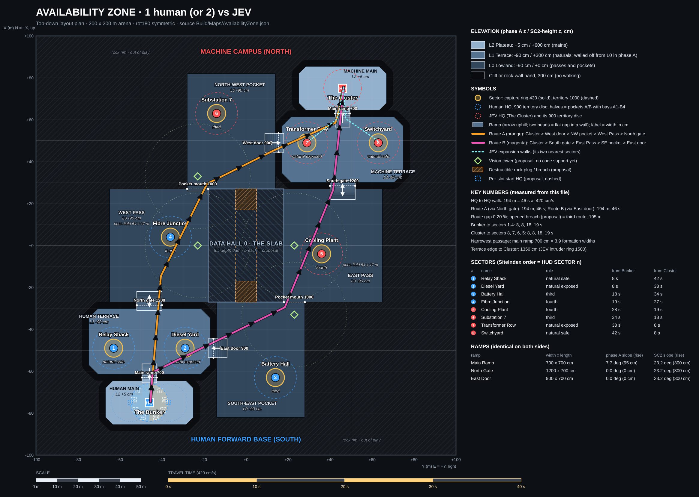

# Availability Zone

*"Guaranteed 99.99% uptime. Humans are counted as downtime."*

First real map: **you (and later a friend) against JEV**, laid out the way a StarCraft 2 ladder map is: a main on high ground behind one ramp, a natural just below it, exposed thirds and fourths, chokes, open fields, and attack routes of equal length. It is drawn on the grid of the new terrain kit (`Art/Terrain`, `Build/GenerateTerrainKit.py`) so it can be assembled from those pieces. **Design only.** Nothing here has been built in Unreal, and the numbers marked *[INFERENCE]* come from reading the code, not from a run.

| File | Role |
| --- | --- |
| `Build/Maps/AvailabilityZone.json` | Source of truth: arena, HQs, sectors, elevation regions, ramps (kit pieces and their footprints), blockers, chokes, pockets and bays, decoration zones, proposals. The Unreal generator reads the same file. |
| `Build/DrawMapLayout.py` | Validates the JSON, measures walking distances, replays the placement rules, draws the plan. `python3 Build/DrawMapLayout.py --report` prints every table quoted below. |
| `Art/Maps/AvailabilityZone-layout.png` | Top-down plan: grid, scale and time bars, level shading, ramps, sectors, HQs, routes, chokes, pockets. |
| `Docs/Maps/AvailabilityZone-implementation.md` | How to build it in Unreal, the code proposals, the verification plan. |



Orientation follows the game's minimap and camera: **+X is up on screen ("north"), +Y is right ("east")**, Z is up. The Bunker is south-west, the Cluster north-east. `EnvKit.py` names hall doors with a different compass; this document always means the minimap.

## At a glance

| | |
| --- | --- |
| Arena | `AArenaBounds.HalfExtent` = (10000, 10000): **200 × 200 m**, square so the square minimap is not stretched. 40 % is walkable (15 872 m²); the rest is rock rim. |
| Grid | The terrain kit's 400 cm cells: every region edge and every ramp piece sits on it. A cliff step is 300 cm. |
| Symmetry | 180° rotation about the origin. Every sector, ramp and choke has a partner at (−x, −y); the script proves it cell by cell. |
| Levels | **Phase B (the design): Lowland 0, Terrace +300, Plateau +600**, exactly two kit steps. **Phase A (playable with today's code): everything at z = 0, level changes as walls.** Phase B needs code proposal P1, see [Code assumptions](#code-assumptions-that-shaped-the-design). |
| Bases | Bunker (human main) `(-7400, -4600)`, Cluster (JEV main) `(7400, 4600)`, each on a Plateau with **one ramp**. |
| Sectors | 8: two naturals per side, a third, a fourth. Nothing sits in the exact centre. |
| Routes | Route A **19 031 cm** and route B **19 032 cm** (45.3 s each, a 0.01 % gap), ending at different human entrances; an optional third through the Slab, 18 970 cm. |
| Bunker → Cluster | 190 m walking, **45 s** at 420 cm/s. |
| Narrowest passage | 700 cm walkable, one `Ramp_Wide` lane = 3.9 force widths. |
| Income at stake | +12/s per commander per established sector: 8 sectors are worth up to 8 × 12 = +96/s each, on top of the 2/s baseline. |

## Setting

A hyperscale campus was being graded into terraces when the Machine stopped needing the contractors. The Offline dug in on the south pad and hung floodlights on the retaining walls. The Machine kept building on the north pad, one data hall at a time, and one very large hall in the middle of the valley: **Data Hall 0, the Slab**, which is what makes the map two lanes wide.

Sector names use the World.md power-infrastructure vocabulary. One joke per surface: the name carries it, the HUD role line stays plain.

| # | Sector | Side | Role (plain) | Flavour line |
| ---: | --- | --- | --- | --- |
| 1 | Relay Shack | Human | Safe natural | "Two bars of signal and a kettle." |
| 2 | Diesel Yard | Human | Exposed natural | "Smells like uptime." |
| 3 | Battery Hall | Human | Third | "Charged. Not by us. Yet." |
| 4 | Fibre Junction | Human | Fourth | "Their cable. Our cable now." |
| 5 | Cooling Plant | Machine | Fourth | "Keeps forty thousand GPUs from noticing us." |
| 6 | Substation 7 | Machine | Third | "Substations 1 to 6 have been reassigned." |
| 7 | Transformer Row | Machine | Exposed natural | "Steps power down. Steps people down too." |
| 8 | Switchyard | Machine | Safe natural | "Please hold. Your call is important to the grid." |

The number is `SiteIndex + 1`, the HUD's `SECTOR n`. Index `i` and `7 − i` are rot180 partners.

## SC2 layout language, as built

| SC2 idea | On this map | Kit piece | Code support |
| --- | --- | --- | --- |
| Main on high ground, one ramp | Plateau 2400 deep, 4000 wide (960 m²); one 700 wide ramp; nothing else touches it | `Plateau_Fill`, `Cliff_Straight`, `Cliff_CornerOuter`, 1 × `Ramp_Wide` | Buildable height is limited today; Phase A is walled, Phase B needs P1 |
| Natural just below the main | Two naturals on the Terrace, **8.3–8.9 s** from the Bunker, 4.5 s from the ramp foot | same, second step | Yes: sectors and outposts work at any Z the navmesh reaches |
| Natural choke | **North gate** (two lanes of 700) and **East door** (one lane of 700) | 2 × and 1 × `Ramp_Wide` | Yes |
| Third and fourth, progressively more exposed | Third in a pocket behind a 1200 mouth (17.6 s from the Bunker, 34 s from the Cluster); fourth in the open pass (18.2 s from the Bunker, **27.5 s** from the Cluster) | `Cliff_*` around the pocket | Yes |
| Wide-open fields | West Pass and East Pass, 52 × 48 m each | – | Yes |
| Chokepoints | Ramp lanes 700, pocket mouth 1200 | – | Yes |
| Multiple attack paths | Route A: Cluster › West door › NW pocket › West Pass › North gate. Route B: Cluster › South gate › East Pass › SE pocket › East door. Same length; different human entrance | – | Geometry yes. JEV's choice between them is **not** designed by code, see [JEV on this map](#jev-on-this-map) |
| Watchtower vision points | 4 towers on cell centres | `Watchtower` (400 cm pad, 900 cm tall, Machine relay pylon) | **No.** No fog of war or vision system: proposal P5. The kit piece already says "vision spot (gameplay later)"; it can stand there as a landmark |
| Destructible rocks | An 800 wide **breach** through the Slab sealed by two plugs, joining the two pockets | `Rocks_Destructible_Large` ×2 (800 wide gap) | **No.** Nothing in the code has hit points and toggles navigation: proposal P4. The Slab ships solid |
| Static rock blockers | The Slab and the rock rim | `Cliff_*`, `Plateau_Fill` stacked | Yes: static collision; navmesh follows |
| Enemy main opposite with its own ramp and natural | Cluster north-east, its own ramp, gate, door, two naturals | the `_Machine` variants | Yes |

## Size and travel times

Unit speed is `MaxWalkSpeed = 420` cm/s (`ArmyUnit.cpp`), so **10 s = 4200 cm** (the second bar on the plan). The README fixes only the match arc, roughly 12–18 minutes, and the current economy sets the pace inside it, not distance: each human commander earns 2/s plus 12/s per established friendly sector; JEV earns `2 × max(1, human commanders) + 12 × established enemy sectors` per second. Both are paid every 2 s (`CommandGameState.h`, `Rules/EconomyPolicy.cpp`, `CommandGameState::Tick`). Distance decides two things: how expensive a losing push is (recruits walk the whole way to their moving formation; there are no teleports) and when JEV's first wave lands. The targets below give a 45 s base-to-base crossing, 2.7 × Boot's straight-line 17 s, and single-digit-second hops between a base and its naturals.

Measured on a 100 cm raster with line-of-sight smoothing, a 100 cm clearance ring, 16-neighbour Dijkstra. Real Detour paths will differ by a few percent; crowds and formation offsets add more *[INFERENCE: not measured]*.

| Leg | Length | Time | Target |
| --- | ---: | ---: | --- |
| Bunker → main ramp top | 1200 cm | 2.9 s | under 3 s |
| Ramp foot → Relay Shack or Diesel Yard | 1887 cm | 4.5 s | about 5 s |
| Ramp foot → gate top / door top | 2800 / 2912 cm | 6.7 / 6.9 s | about 7 s |
| Gate top ↔ door top (across the Terrace) | 3441 cm | 8.2 s | one response window |
| **Bunker → natural** (Diesel Yard / Relay Shack) | 3478 / 3730 cm | **8.3 / 8.9 s** | 8–9 s |
| Bunker → third (Battery Hall) | 7403 cm | 17.6 s | 15–20 s |
| Bunker → fourth (Fibre Junction) | 7642 cm | 18.2 s | 15–20 s |
| Bunker → Cluster's exposed natural | 15 941 cm | 38.0 s | 35–45 s |
| **Bunker → Cluster** | 19 032 cm | **45.3 s** | 45 s |
| Cluster → human gate foot / door foot | 13 640 / 14 075 cm | 32.5 / 33.5 s | within 1 s |
| Cluster → human main ramp foot | 16 960 cm | 40.4 s | – |

The Cluster's row is the mirror of the Bunker's (Cluster → Transformer Row 3456 cm, 8.2 s; → Switchyard 3852 cm, 9.2 s).

## Levels, ramps and the kit grid

Three levels, one kit step (300 cm) between neighbours. Regions **touch** along a boundary; the boundary is the cliff line of the kit's `Cliff_*` pieces on the higher side.

| Level | Phase A z | Phase B z | What lives here |
| --- | ---: | ---: | --- |
| L2 Plateau | 0 | +600 | Mains (960 m² each) |
| L1 Terrace | 0 | +300 | Naturals (2016 m² each) |
| L0 Lowland | 0 | 0 | Passes (2496 m²), pockets (2464 m²) |

**Grid.** The kit is 400 cm cells centred on multiples of 400; cell edges are odd multiples of 200. The script fails if any region vertex, blocker vertex or ramp piece centre is off that grid, or a ramp piece is not a multiple of 90° (checked for every edit of the JSON). Rim (everything outside the walkable regions) is rock: cells one step higher than their highest playable neighbour.

**Ramps** (kit `Ramp_Wide`, mirrored as `Ramp_Wide_Machine`): footprint 800 × 800, run 800 cm, rise 300 cm, **20.56°** (kit limit 30°, engine walkable angle 44.8°), walkable strip **700 cm** between 50 cm parapets, top edge exactly on the higher region's edge.

| Ramp (both sides) | Pieces | Walkable width | Role |
| --- | ---: | --- | --- |
| Main ramp, Plateau → Terrace | 1 | 700 | The only way into a main |
| North gate, Terrace → Lowland | 2 side by side | 2 lanes × 700 (a 100 cm parapet between) | Front choke |
| East door, Terrace → Lowland | 1, facing east | 700 | Side choke |

**Sizing against the units.** Capsule radius 34, half-height 60 (`ArmyUnit.cpp`). A produced force uses columns 110 apart and rows 110 apart (`AArmyGroup::FormationOffset`, `bProducedGroup`): **180 cm wide, 290 cm deep** for a Frontline force of six, less for smaller forces. Rules used:

- Every lane on an army route is at least **3 force widths (540 cm)** wide (the script checks this against the JSON); the narrowest lane, one kit ramp strip, is 700 (630 after the navmesh's 35 cm agent erosion). A lane takes three forces abreast; the gate takes six across its two lanes.
- The kit's ramp is 20.6°, steeper than the 12° this document first assumed. It is well inside the character's 44.7° limit and the kit's own check, and it is the only ramp the kit offers, so it is the design value.
- The last 103 cm of a recruit's path disables predictive avoidance (`PrecisionRadius = 2 × radius + 35`), so corridors should not have a corner tighter than about 300 cm. The kit rounds convex corners at 400 cm (`Cliff_CornerOuter`) and fills concave ones with a 400 cm fillet (`Cliff_CornerInner`).
- **Nothing on a ramp or at a choke can be walled off**: no ramp footprint or named choke lies inside any territory disc. Tightest margins: East door 200 cm beyond Diesel Yard's disc, main ramp 300 cm beyond the HQ disc. Buildings are navigation obstacles here (`NavArea_Null`), so this matters: the HQ and controlled, uncontested-sector territory limits constrain where a player can plug a choke, even without an outpost.
- A two-lane gate has a central parapet that a mid-fight crowd cannot cross; each lane is judged separately.

## Sector list

Build territory for barracks/workshops: HQ 900, controlled uncontested sector 1000 (`ACapturePoint::TerritoryRadius`), accounting for footprint; capture grants sector build rights without an outpost. A completed, living outpost adds income and locks capture; bare capture gives no sector income. Capture ring: 430. These are rule distances, not placement-preview circles; placement uses a 50 cm grid. Every capture ring and the Bunker's and Cluster's territory discs lie fully on one level (the script checks them).

| # | Sector | Position (x, y) | Level | Role | Why here |
| ---: | --- | --- | --- | --- | --- |
| 1 | Relay Shack | (−4400, −6200) | Terrace | Safe natural | Deep behind the North gate; route A passes 2033 cm away. The production site for a second commander |
| 2 | Diesel Yard | (−4400, −3000) | Terrace | Exposed natural | Beside the East door: route B passes 818 cm away |
| 3 | Battery Hall | (−6200, 1000) | Lowland | Third | In the SE pocket behind a 1200 wide mouth. Route B passes 2600 cm away, so it is not swept automatically |
| 4 | Fibre Junction | (200, −3800) | Lowland | Fourth | Open field 559 cm off route A. Any JEV push on route A passes it |
| 5 | Cooling Plant | (−200, 3800) | Lowland | Fourth (Machine) | Rot180 of 4, on route B |
| 6 | Substation 7 | (6200, −1000) | Lowland | Third (Machine) | Rot180 of 3 |
| 7 | Transformer Row | (4400, 3000) | Terrace | Exposed natural (Machine) | Rot180 of 2 |
| 8 | Switchyard | (4400, 6200) | Terrace | Safe natural (Machine) | Rot180 of 1 |

Distances from each HQ are in the plan's sector table. The progression the brief asks for shows up in the distance from the *enemy* HQ: naturals 38–40 s, thirds 34 s, fourths 27–28 s.

### Headquarters, plateau and pockets

| | Bunker | Cluster |
| --- | --- | --- |
| Position (x, y) | (−7400, −4600) | (7400, 4600) |
| HQ actor z | 110 (Phase A) / 710 (Phase B) | same |
| Plateau | x −8600…−6200, y −6600…−2600 | rot180 |
| Plateau edge to HQ | 1200 cm north and south, 2000 cm east and west | same |
| Ramp top edge to HQ | 1200 cm | same |

The HQ disc (radius 900) sits fully on the plateau with 300 cm to spare; buildings need their nav samples at footprint + 65 cm on navigable ground, so about the outer 200 cm of the disc is unusable, which the 300 cm margin absorbs.

**Build pockets.** The Bunker disc is split into two halves by the line `y = −4600`: **Pocket A** (west) and **Pocket B** (east), with four authored barracks **bays** each (`A1–A4`, `B1–B4`, radius 750 from the HQ, at least 476 cm apart, all passing the placement rules, none in the ramp's approach). The disc is unclaimed shared space in today's code, so the pockets are a **convention made legible by paint**: numbered bay markings on the deck. Measured capacity (100 cm cells, greedy packing at 305 cm hard spacing / 550 cm practical spacing that keeps an exit lane):

| Zone | Barracks cells | Barracks packed (hard / practical) | Workshop cells |
| --- | ---: | ---: | ---: |
| Bunker disc | 156 m² | 18 / 7 | 136 m² |
| Each pocket half | 78 m² | – / 4 | 68 m² |
| Each natural, third, fourth | 248 m² | 24 / 10 | 232 m² |

JEV's needs are met too: `AEnemyCommander::BuildNear` (4 rings at 360, 510, 660, 810 cm, 12 directions, at z = 5) finds valid spots for **three barracks and one workshop** around the Cluster, and for an outpost at every sector.

## How it plays with the current code

### One player

- The Bunker disc holds four to seven barracks, all in one place. Start with two (440 of the 600 opening resources).
- Take Diesel Yard and Relay Shack in the first minute. Both are 4.5 s off the ramp foot, and the Terrace's two entrances are 8.2 s apart: **hold the ramp foot** (6.7 s to the gate, 6.9 s to the door) instead of either choke.
- Battery Hall is quiet behind its mouth. Fibre Junction is the greedy expansion: it sits on route A.
- Realistically **three sectors by about 2:15, four by about 4:00** if the first JEV wave is beaten *[INFERENCE]*.

### Two players, same map, no rebuild

The level places exactly what one player needs, and two players fit without changes: `HandleStartingNewPlayer` gives each commander a slot (0–4), a private wallet and a camera; every commander builds in shared HQ or controlled uncontested-sector territory, with no outpost prerequisite for barracks/workshops; income is per commander. The layout adds what a second person needs:

- **Two pockets** (A west, B east) in the shared Bunker disc, four bays each.
- **Two naturals with different jobs**: Relay Shack is the safe production site, Diesel Yard is the front. A friend takes one each, or swaps.
- **Two entrances to guard** (gate and door): one commander sets barracks fronts on the gate, the other on the door.
- **No new code**: nothing here needs a second HQ. All players share the Bunker, the win condition (destroy the Cluster) and the loss condition (lose the Bunker).

Honest limits of the shared-HQ arrangement (all from the code):

- **No claim system.** The server only checks territory, overlap, navigation and money, not which commander stands where. Two players can build over each other's bays; the pockets are a courtesy, and the bay paint makes it visible.
- **Same camera start.** `bInitialFocusPending` focuses the friendly HQ for every commander. Both start on the Bunker.
- **Only JEV's baseline scales.** Its one wallet earns `2 × max(1, human commanders) + 12 × established enemy sectors` per second; the sector bonus is unscaled. With two humans and three shared established friendly sectors, the team makes 2 × (2 + 12 × 3) = **76/s** against JEV's 2 × 2 + 12 × 2 = **28/s** with its two established naturals. Paid every 2 s, that is 152 for the human team (76 each) and 56 for JEV. Human sector income scales with commander count; JEV's does not, so 2P still has an economic advantage without proposal P3.
- **Space.** 2P needs about eight barracks plus workshops. The Bunker disc holds seven practically, so the second player's production lives on the naturals (10 practical each).

### PROPOSAL: per-player start locations (code the gameplay team would own)

*A proposal, not required for 2P testing.* Give each commander their own start HQ on the same plateau. It is already 4000 cm wide for this: two HQ discs of radius 900 centred `(−7400, −5500)` and `(−7400, −3700)` tile it with 200 cm margin, and the ramp stays on the centre line between them. The two `per_player_start` entries in the JSON give the positions.

What it needs (P2 in the implementation doc): `AHeadquarters` gets a `StartSlot`; `ACommandGameState` holds an array of friendly HQs; `ValidateBuildingPlacement` uses the placing commander's HQ; the camera focuses on the owner's HQ; the HUD shows one bar per HQ; the loss rule needs a decision (any HQ, all HQs, or the primary). Benefits: real ownership of a base, no pocket courtesy, a clean 3–5 player story. Costs: a second HQ is a second target, and a second team-0 `AHeadquarters` currently only logs an error (`InitGameState`) and is ignored.

## JEV on this map

Facts from `EnemyCommander.cpp` that decide the map's role:

- **JEV builds around its HQ**, at fixed z = 5, in rings of 360 to 810 cm. Its plateau therefore has to be flat, open, and within reach of z = 5. It is.
- **Target score** for each sector is `(5 if neutral or Machine-held, 3 if human-held) − straight 2D distance / 1200`, not path length, so cliffs do not count. Ranked from the Cluster:

  | Sector | Straight | Neutral | Human-held |
  | --- | ---: | ---: | ---: |
  | 7 Transformer Row | 3400 | 2.17 | 0.17 |
  | 8 Switchyard | 3400 | 2.17 | 0.17 |
  | 6 Substation 7 | 5727 | 0.23 | −1.77 |
  | 5 Cooling Plant | 7642 | −1.37 | −3.37 |
  | 4 Fibre Junction | 11 063 | −4.22 | −6.22 |

  7 and 8 tie; the strict `>` keeps the first in `SiteIndex` order, so **JEV goes for Transformer Row first** (the exposed natural), then Switchyard.
- **Assault trigger**: two established sectors, or a living force of 12 (6 + 4 + 2). With two naturals established JEV **stops expanding and marches on the Bunker**, so it never takes Substation 7 or Cooling Plant unless a natural falls. Those two are free ground for the human, and so is the rest of the map.
- **Approach route**: Detour's shortest path, always. With today's code JEV cannot choose a lane.
- **Defend and retreat points** are hard-coded offsets from its HQ: Defend at `HQ + (−400, −250)` and fall back to `HQ + (−500, 0)`. They point toward −x, i.e. toward the Bunker, on its own plateau. **This map only works if the Bunker is on JEV's −x side.** It is: the Cluster's plateau extends 1200 cm south of the HQ.
- **Intruder rule**: it switches to Defend when human units stand within 1500 cm of its HQ. The Cluster's terrace lip is 1200 cm away (300 cm margin), so a raid on the lip triggers the defence; a raid on the natural (3456 cm) does not.

### Expected timeline *[INFERENCE from the rules, unmeasured]*

| Time | JEV | Human (efficient) |
| --- | --- | --- |
| 0:02 | First planner tick places a barracks | Place a barracks around 0:05 |
| 0:14–0:17 | Barracks done (12 s); production starts | Barracks done ~0:17 |
| ~0:35 | Six Frontline out; first unit at Transformer Row ~0:28, capture 8 s | First unit at Diesel Yard ~0:28, capture 8 s |
| ~0:46 | Outpost (9 s) up: 1 established | Outpost up ~0:47 |
| ~1:25 | Switchyard established: 2 established, plan flips to **assault HQ** at the next 12 s commit | Relay Shack by ~1:10 |
| ~1:35–1:45 | Wave leaves (6–12 units) | Battery Hall ~1:40–2:00 |
| ~2:10–2:20 | Wave at the Terrace, 33 s of walking (gate foot 32.5 s, door foot 33.5 s) | Ramp foot held |

A human rush leaving the barracks at ~0:40 reaches Transformer Row 38 s later, about 1:18, before JEV's second sector.

### Attack routes

Closing one human entrance forces the other, so the script measures both. **Route A (North gate) 19 031 cm, route B (East door) 19 032 cm: a 0.01 % gap**; the optional breach adds a third at 18 970 cm (0.3 % shorter than either). By symmetry the two main routes are equal, and the raster resolves them to well inside its own noise, so **which one JEV uses is not decided by this map**. Crowd offsets, per-unit start positions and navmesh tile choices are all bigger than 0.01 %; expect either, possibly a split. Two real facts stay true regardless: a defender who sits on one choke does not cover the other (8.2 s apart across the Terrace), and no choke can be built shut, so JEV cannot be pushed into a single route by building.

What the map alone **cannot** promise is that JEV will *rotate* routes over several waves or flank on purpose. That needs P3 (waypoints or route choice in the planner); authored waypoints for both routes are already in the JSON (`routes.jev_to_human`).

## Chokes, fields, blockers, vision

| Feature | Position | Size | Status |
| --- | --- | --- | --- |
| Main ramp | (−5800, −4600) | 700 | Phase B piece, Phase A gap |
| North gate, 2 lanes | (−2200, −5000) and (−2200, −4200) | 700 + 700 | same |
| East door | (−4600, −1400) | 700 | same |
| Pocket mouth SE | (−2600, 2400) | 1200 | both phases |
| Mirrors of the four above | rot180 | same | same |
| West Pass, East Pass | (0, ∓4200) | 5200 × 4800 | both phases |
| The Slab (Data Hall 0) | (0, 0) | 5200 × 3600 | both phases, solid |
| Rock rim | everything outside the walkable regions | – | both phases |
| Breach through the Slab, plugs at each end | x −2600…2600, y −400…400 | 800 wide | **proposal P4** |
| 4 watchtowers | (0, ∓2400), (∓3200, ±2400) | vision radius 2500 | **proposal P5** |

The breach, if opened, adds a third route from the SE pocket through the Slab into the NW pocket. That is a mid-game map change: whoever blasts a plug decides when the map opens.

## Themes per area

Kit pieces are in `Art/Environment/` (`EnvKit.SPEC`) and `Art/Terrain/` (`GenerateTerrainKit.py`, Human look and `_Machine` look); textures are the CC0 set in `Art/Textures` (`SOURCES.md`). **Proposed new pieces** are only the ones marked *new*; the terrain kit already provides cliffs, ramps, rocks and the watchtower. The master material `M_Shared` and the colour language in World.md apply: dark environment, saturated colour only for team, glow and power.

| Area | Look | Terrain kit | Ground and trim | Environment kit | New |
| --- | --- | --- | --- | --- | --- |
| **Bunker plateau** (human main) | Prefab forward base on landing struts; painted bay numbers; floodlights along the lip | `Plateau_Fill`, `Cliff_Straight`, `Cliff_CornerOuter`, `Ramp_Wide` | `Panel/MetalPlates002`, `Concrete/Concrete016`; trim `Tread/DiamondPlate001` | `GeneratorShack`, `Container`, `SandbagWall`, `BurnBarrel`, `FenceSegment`, `CableSpool` | `FloodlightMast`, bunker annex, helipad pad, `BayDecal` |
| **Human Terrace** | Graded pad, haul roads, hazard-striped edge | same plus `Cliff_CornerInner` | `Concrete/Concrete024`, `Asphalt/Asphalt026A`; trim `Hazard/PaintedMetal016` (worn only) | `Container`, `Wreck`, `SandbagWall`, `FenceSegment`, `BurnBarrel`, `Transformer` | `HaulTruck`, `SpoilHeap` |
| **Battery Hall pocket** | Half-dug battery bank, cable runs | `Cliff_*` on the rim | `Ground/Gravel006`, `Asphalt026A` | `Chiller`, `Transformer`, `CableSpool`, `Wreck`, `Container` | `SpoilHeap` |
| **Cluster plateau** (Machine main) | The Cluster's lit plaza, pearl deck, cyan seams, ring of `ClusterPylon` | the `_Machine` set | `SciFiFloor/Tiles108`, `Panel/MetalPlates006`; trim `PaintedMetal/Metal032` | `ClusterPylon`, `Pylon`, `CommsMast`, `Transformer`, `Chiller` | – |
| **Machine Terrace** | The Machine campus: server halls, cooling towers, cyan cables to every sector | the `_Machine` set | `Concrete024`, `Tiles108` inlays | `DataHallBay/Door/Corner/Roof`, `CoolingTower`, `Chiller`, `Transformer`, `Pylon` | – |
| **Substation 7 pocket** | Transformer yard, chain of pylons | `_Machine` cliffs | `Concrete024`, `Asphalt026A` | `Transformer`, `Pylon`, `Chiller`, `CableSpool`, `CoolingTower` | – |
| **Passes** | Dry lakebed and haul road, wrecks and spoil for scale, nothing that blocks | rim cliffs, `Watchtower` | `Asphalt026A`, `Gravel006`, `Gravel004` patches | `Wreck`, `Container`, `CableSpool`, `Pylon` | `SpoilHeap` |
| **The Slab** | Data Hall 0: one huge hall, 52 × 36 m, cooling towers on the roof | `Rocks_Destructible_Large` (breach plugs) | – | `DataHallBay/Door/Corner/Roof` through `assemble_hall`, `CoolingTower` | – |
| **Rock rim and backdrop** | Cut rock and retaining walls, dark; horizon and sky beyond | `Cliff_*`, `Plateau_Fill`, stacked to one step above the tallest neighbour | `Gravel004`, `Concrete016`; the kit's rock look is Blender-authored, so no rock texture is needed for the rim | – | `BackdropRing` |

A Human/Machine split follows the diagonal: the south-west half uses the Human look, the north-east half the Machine look, the passes and the Slab mix (Human cliffs on the human side of the centre line, Machine cliffs on the other).

## Balance notes

- **Rush distance**: 190 m, 45 s. JEV's first wave lands about 2:10–2:20; a human rush at 0:40 can be at JEV's exposed natural at about 1:18 and, if it stands on the lip, forces a Defend.
- **What each side can hold**: human realistically 4 sectors by mid-game, 5–6 if it pushes; JEV **2** (its naturals) because it assaults at two. That is 2 + 12 × 4 = **50/s** per commander with four established sectors (2 + 12 × 6 = **74/s** with six) against JEV's 2 × 1 + 12 × 2 = **26/s** in solo, or 2 × 2 + 12 × 2 = **28/s** in 2P. Whether this is a fair fight depends on JEV's force sizes, not on the map: the numbers show why JEV needs help (P3).
- **What JEV contests first**: Transformer Row, then Switchyard. It does not contest the middle at all until it assaults, and it never picks Cooling Plant or Substation 7 while two sectors are established.
- **2P vs 1P**: at the same established-sector counts, 2P doubles the human team income; JEV's baseline rises from 2/s to 4/s, but its sector bonus stays fixed. With four friendly sectors and two enemy sectors, solo is 50/s against 26/s; 2P is 2 × 50 = **100/s** against **28/s**. This income asymmetry can make the friend test easier; it is not a map change.
- **Ranged and siege ignore height.** `WeaponRange` is a 2D distance and there is no line-of-sight or high-ground rule (`ArmyUnit.cpp`). Siege (range 1150) standing on the Terrace lip (x = −6200) reaches any building whose centre is north of x = −7350: bays A1/B1 (x = −6860) and A2/B2 (−7283) are in reach; A3/B3, A4/B4 and the HQ (−7400, 1200 cm from the lip) are not. Ranged (560) reaches nothing on the plateau from the lip. *[INFERENCE from the range check]* Proposal P5 (high ground) fixes this properly; until then the plateau's north half is shellable from below.
- **Intruder margin**: 1200 vs 1500 cm. The 300 cm margin is what makes a raid on the lip trigger the Defend behaviour, so do not deepen the plateau.

## Code assumptions that shaped the design

| Assumption in the code | Where | What it does to a map | How this map copes |
| --- | --- | --- | --- |
| **One shared friendly HQ**, one enemy HQ | `CommandGameMode::InitGameState`, `ACommandGameState::FriendlyHeadquarters`, `ValidateBuildingPlacement` (`Home`) | A second team-0 HQ only logs an error. All commanders share one 900 cm disc. Only one HQ bar in the HUD | One HQ, two pockets, two naturals; per-player start is proposal P2 |
| **Territory is 2D**: HQ 900 cm, controlled uncontested sector 1000 cm (capture alone grants barracks/workshop build rights; no outpost required) | `PlacementPolicy::EvaluateTerritory`; `ACapturePoint::TerritoryRadius` | Discs ignore height and cliffs and can plug a choke; capture rings ignore cliffs. Completed, living outposts add income and lock capture, not build rights | Discs sit on one level; no ramp or choke lies in any disc (checked) |
| **Rectangular, origin-centred arena**, `\|z\| ≤ 1000` | `AArenaBounds::ContainsTravel`, `HalfHeight` | Non-rectangular play areas are made with rock and navmesh, not bounds. The minimap is square and stretches a non-square arena | Square arena; rock rim; the rim needs dressing because the camera can pan to the edge |
| **Clicks are on the plane z = 0** and forced to z = 0 | `ACommandPlayerController::CursorGround`, `CommandCamera::FocusOn`, `CommandMinimap` | A placement or front on any level is evaluated at z = 0 | Phase A: every playable level at z = 0. Phase B: P1 |
| **Placement overlap box** `Location.Z + 10…120` against world collision; nav samples within 110 cm of `Location.Z`, extents (45, 45, 200), samples at footprint + 65 | `ValidateBuildingPlacement` | **Ground higher than +10 cm blocks every building on it**; ground lower than −110 cm is unplaceable; buildings need about 200 cm of navigable margin from cliffs. Buildable relief is therefore about 100 cm (−95…+5), less than one 300 cm kit step | Phase A flat; the script replays the rules (`placement_ok`, `check_elevation`). An optional "Phase A+" with a 95 cm plateau is possible but needs a short custom piece, not the kit |
| **JEV builds and marches at z = 5**, rings 360–810, Defend `−400, −250`, fall back `−500, 0` | `EnemyCommander.cpp` (`BuildNear`, `Front.Z`) | JEV cannot use ground far from z = 5. Its offsets fix which side of its HQ the plateau must extend | Flat in Phase A; Cluster on the north-east with the Bunker at −x |
| **JEV chooses by straight distance** and assaults at 2 sectors or 12 units | `EvaluatePlan` | Path length and cliffs are invisible; JEV never takes the third or fourth | Naturals are nearest; the rest is free ground |
| **JEV always takes the shortest nav path** | Detour | One lane per wave; two equal routes give no guaranteed split | Equal routes plus proposal P3 |
| **No vision, no fog, no high-ground rule**; range is 2D | `ArmyUnit::WeaponRange` | Watchtowers and cliff advantages do nothing in code | Proposal P5; cliffs only block movement |
| **Buildings are nav obstacles; none can be destroyed except by fire; finished ones cannot be cancelled** | `ACommandBuilding` (`NavArea_Null`) | Walls and plugs are possible in territory; nothing in code opens a path later | No choke in a disc; breach is proposal P4 |
| **JEV scales only its baseline with human commander count**: `2 × max(1, humans) + 12 × established enemy sectors` per second | `ACommandGameState::GetEnemyIncomePerSecond`, `EconomyPolicy::EnemyIncomePerSecond` | Human team sector income scales with commander count; JEV's sector bonus does not. 2P still has an economic advantage at equal territory | Noted; proposal P3 |
| **Five commanders, slots 0–4** | `PreLogin`, `HandleStartingNewPlayer` | No per-slot start, spawn or camera position | Same start for all |
| **Maps are hard-coded in the harness** | `verify.py` (`/Game/Maps/Boot`), `network.py`, `Build/MatchLayout.py` | The new map cannot be smoke-tested until the harness takes a map argument | Listed in the implementation doc |

## Data file and regeneration

```bash
python3 Build/DrawMapLayout.py --report          # all checks and tables; exit status 1 on any failure
python3 Build/DrawMapLayout.py                   # rewrites Art/Maps/AvailabilityZone-layout.png
python3 Build/DrawMapLayout.py --svg /tmp/az.svg # also keep the SVG
```

Needs `rsvg-convert` or ImageMagick, no Python packages. Checks: level overlap, kit-grid alignment of regions, blockers, ramp pieces and towers, ramp ends and slopes and lane widths, sectors and capture rings on one level, HQ discs on their plateau, no ramp or choke inside a territory disc, choke widths, rot180 symmetry, reachability, route equality within 3 %, the human terrace unreachable without gate and door, placement coverage, bays, JEV's `BuildNear` replay and outposts, Phase A heights against the two build heights, and the terrace lip within JEV's intruder radius.

## Questions for the owner

1. **Elevation.** Today's code cannot host the kit's 300 cm steps on buildable ground (proposal P1). Do P1 first and build Phase B directly, or ship the flat walled Phase A greybox first?
2. **JEV routes.** Are two equal routes enough, or is a lane choice in `EnemyCommander` (P3) a precondition for calling the map done?
3. **Second start.** Do you want the per-player start proposal (P2) built before the friend test, or is the shared Bunker with paint bays enough for the first co-op session?
4. **JEV at two players (original design question).** Should JEV's income scale with the commander count for 2P, or should the first friend test show the raw difference? **Current code:** the baseline already scales (`2 × max(1, humans)`/s); the +12/s per established enemy sector does not.
5. **Names.** The map name and sector names are placeholders in the World.md tone; confirm or replace them before art and HUD copy depend on them.

## v2 direction (user feedback)

Recorded from the owner's review of the v1 design. None of it changes the v1 build (Phase A flat, one shared Bunker, two routes); it is the brief for the next map revision.

- **A bigger map with real choices.** The player chooses which area to focus on and expand into. v1's two primitive routes (west gate, east door) are too few; v2 needs more than two routes and more areas worth taking, so that where to expand is a decision and not a walk down the only corridor.
- **Heights come back after P1.** Height adds real value (ramps as chokes, high-ground bases, readable levels), so Phase B (kit heights, +300 and +600) returns as soon as proposal P1 (ground-height-aware placement, orders and JEV) lands. The flat Phase A greybox is a stepping stone to it, not the end state.
- **More area ideas to come.** The owner has more area ideas to discuss later; nothing in this document fixes v2's areas, sizes or routes.
