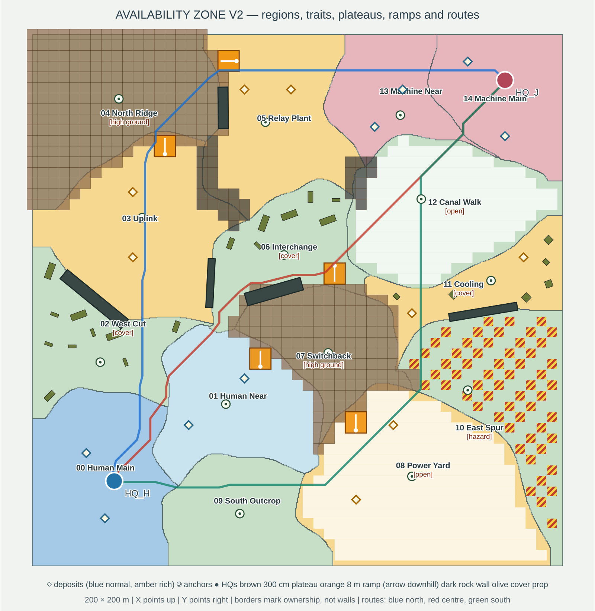

# Availability Zone v2 — playable greybox, strategy regression pending

Source of truth: [`Build/Maps/AvailabilityZoneV2.json`](../../Build/Maps/AvailabilityZoneV2.json), derived from [`AvailabilityZone-v2-extractor-sites.excalidraw`](../../Art/Maps/AvailabilityZone-v2-extractor-sites.excalidraw). `./x gen draw-availability-zone-v2` validates the JSON, measures travel on a 100 cm raster with rock clearance and renders this plan; derivation and validation procedures are in [`./x help gen`](../../x):

**Orientation:** +X is minimap-up, +Y right. The arena is 200 × 200 m, at z=0 except two 300 cm plateaus; the Bunker is at (−6807, −6912) cm and the Cluster at (8281, 7825) cm. Fifteen shared-border polygons cover all 40,000 m²; ownership borders are **not** walls. Five short rock barriers provide partial cover. There are thirteen capture anchors, one per non-main region, and sixteen proposed deposits: two normal in each main and natural, two rich in each amber region. The economy proposal's *three* rich deposits per amber conflicts with the sketch's two diamonds; this data follows the drawn sites. No deposit type beyond Power or extractor yield is encoded here.

The source drawing is **not 180° symmetric**: its HQs miss a rotational mirror by 1733 cm and the two mains are 3136 versus 2139 m². Mirroring it would change the approved geography; balance must be checked in play. Map-scale fairness is an open design question.

| Index | Region | Role | Area (m²) | H → anchor (s) | J → anchor (s) |
| ---: | --- | --- | ---: | ---: | ---: |
| 0 | Human Main | main | 3136 | — | — |
| 1 | Human Near | natural | 2658 | 12.9 | 39.5 |
| 2 | West Cut | tactical | 2059 | 11.2 | 46.9 |
| 3 | Uplink | reward | 3613 | 24.9 | 39.6 |
| 4 | North Ridge | tactical | 3285 | 36.5 | 37.0 |
| 5 | Relay Plant | reward | 2997 | 38.0 | 23.1 |
| 6 | Interchange | tactical | 1942 | 27.3 | 26.4 |
| 7 | Switchback | tactical | 1923 | 24.5 | 30.9 |
| 8 | Power Yard | reward | 4805 | 27.1 | 38.9 |
| 9 | South Outcrop | tactical | 2075 | 12.6 | 48.7 |
| 10 | East Spur | tactical | 2929 | 35.4 | 30.2 |
| 11 | Cooling | reward | 1510 | 41.5 | 18.4 |
| 12 | Canal Walk | tactical | 3298 | 38.2 | 13.6 |
| 13 | Machine Near | natural | 1632 | 44.3 | 10.8 |
| 14 | Machine Main | main | 2139 | — | — |

Bunker → Cluster: **51.4 s** at 420 cm/s by the same 100 cm, eight-neighbour path estimator, which now routes over ramps and around cliffs, rock walls and cover props. These are *design estimates*, not measured Unreal Detour paths, and omit crowding and capture time. `./x gen draw-availability-zone-v2` produces the complete areas/travel table ([`./x help gen`](../../x)). The validator checks exact shared-edge topology/outer perimeter, CCW winding, 100 cm sampled tiling, symmetric neighbour lists, anchors, all 16 extractor footprints within their regions, HQ placement and rock clearance.

## Generated greybox and playtest gate

[Built] `./x gen generate-availability-zone-v2` ([`./x help gen`](../../x)) creates only `/Game/Maps/AvailabilityZoneV2`; it does not replace v1. The runner owns module freshness and generation locking.

[Built] The menu defaults to **Availability Zone v2**, with classic **Availability Zone** selectable beside it. Both **Play vs JEV** and **Host co-op** use the selection; Play Again stays on the current map. Offline menu play uses `./x play` ([`./x help play`](../../x)); cooked Development/Shipping artifacts use `./x package` ([`./x help package`](../../x)).

`Config/DefaultGame.ini` includes v2 in `MapsToCook`. Configuration alone does not prove an old package contains it; a fresh requested-map launch is required.

[Built] The generator places an arena, two HQs, 13 resource-kind `ACapturePoint`s with **SiteIndex equal to region index**, 15 native `AMapRegion`s, 16 native `ADepositSite`s, ground, rock collision and dynamic navigation. Native actors and non-colliding painted borders/deposit diamonds use the same JSON. Generation is not strategy regression proof; see [Balance.md](../Balance.md) for the later autonomous-match record and its limits. [Built] Terrain, below. [Candidate] Destructible rocks, watchtower vision, per-player HQs and economy balance remain outside this greybox pass.

## Terrain and traits

[Built] Each region has a `trait` in the JSON (`high_ground`, `cover`, `open`, `hazard` or none), and a `terrain` block holds the plateaus, ramps, closed borders, cover props and routes; `--derive` keeps both. Terrain runs on the terrain kit's 400 cm grid (a cell belongs to the region holding its centre). The trait effects are not built here ([map.md](../Design/map.md#region-traits-new--decided)).

| Trait | Regions | Terrain |
| --- | --- | --- |
| High ground | 4 North Ridge, 7 Switchback | 300 cm plateau; one 8 m Ramp_Wide to each neighbour listed below; every other border is a cliff |
| Cover | 2 West Cut, 6 Interchange, 11 Cooling | 23 env-kit props (sandbags, containers, wrecks, fences, chillers, transformers, cooling towers, cable spools) beside the existing rocks |
| Open | 8 Power Yard, 12 Canal Walk | flat, no rocks or props, paved apron |
| Hazard | 10 East Spur | flat; hazard-striped plates and glowing vents, no collision |

Ridge ramps lead to Uplink (3) and Relay Plant (5); Switchback ramps lead to Human Near (1), Interchange (6) and Power Yard (8). Ramps stand on the lower region's ground. A plateau covers every 4 m cell its region's polygon touches, so no ground-level strip is left inside a plateau region (units at a cliff foot belong to the neighbour). Ground heights (camera focus, minimap and cursor picks, building placement) come from `GroundHeight`, which only counts actors tagged `Ground`: the generator tags the floor, plateau, wall and ramp pieces, so maps without tagged ground keep their z = 0 rules.

**Closed borders** leave `neighbours` (supply and orders follow what units can walk): rock walls between 2–6, 3–5 and 5–12, and plateau cliffs between 7–10 and 7–11. Nothing else about adjacency, anchors, deposits or posts changed. Necks with two neighbours: North Ridge (3, 5) and East Spur (8, 11).

| Route | Regions | Length | Time | Costs |
| --- | --- | ---: | ---: | --- |
| North (Ridge) | 0-2-3-4-5-13-14 | 282 m | 67 s | longest; both rich rewards 3 and 5; two ramps over the ridge |
| Center (Hub) | 0-1-6-12-14 | 227 m | 52 s | shortest; 13 m gap between 1 and 6; cover hub |
| South (Spur) | 0-9-8-10-11-12-14 | 261 m | 59 s | open ground (+15% speed) but a hazard stretch (about 23 damage at 4/s) |

Times count open ground at +15% speed. The audit (`./x gen draw-availability-zone-v2`) enforces the trait counts, the ramp and prop placement rules, the walkable graph equalling `neighbours`, walkable routes and the stretch rule on raised ground. Authored posts did not move.
